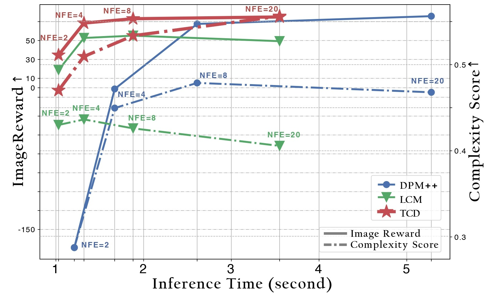
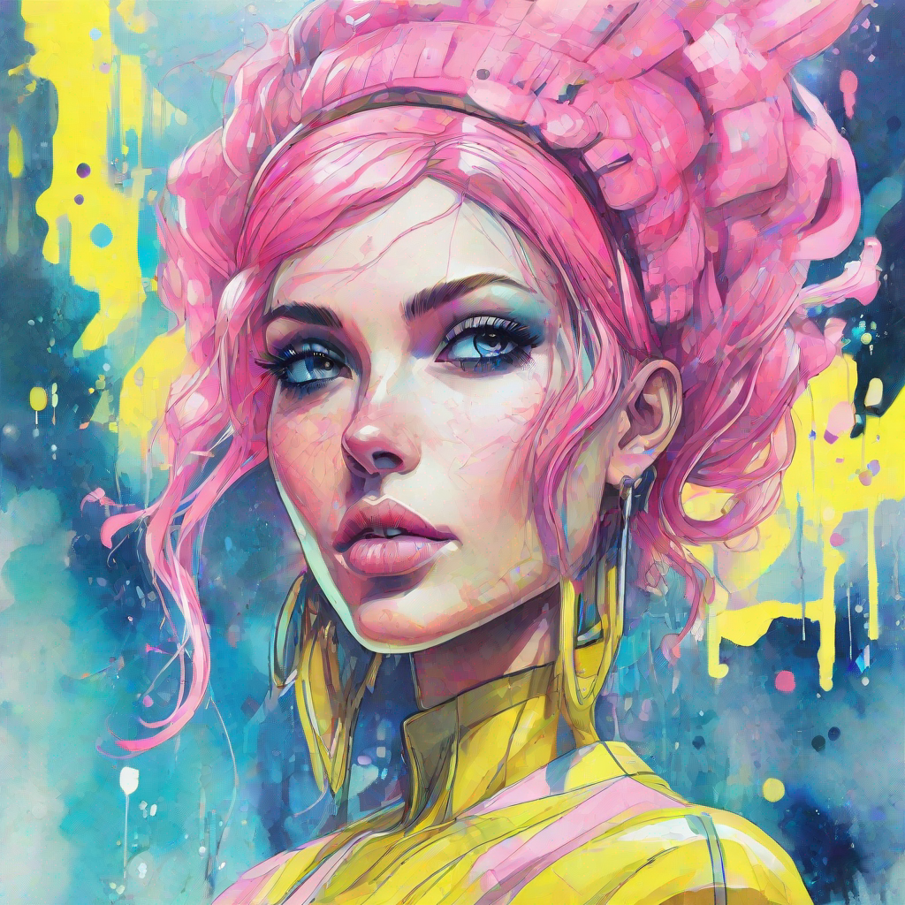
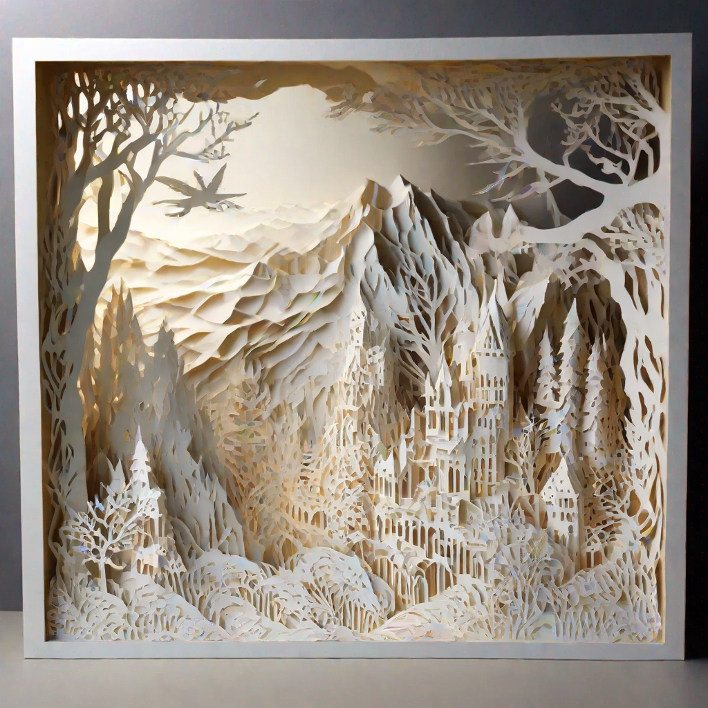
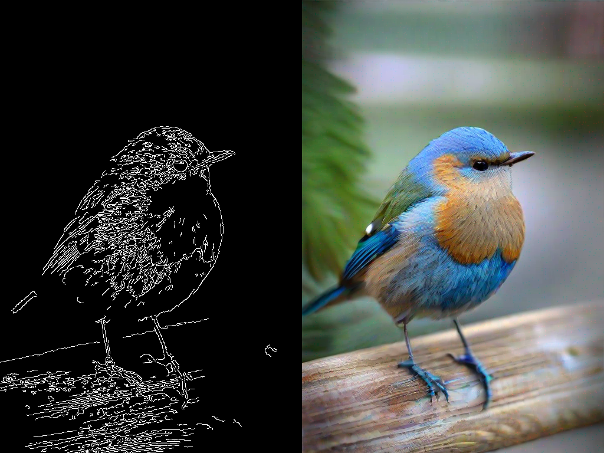
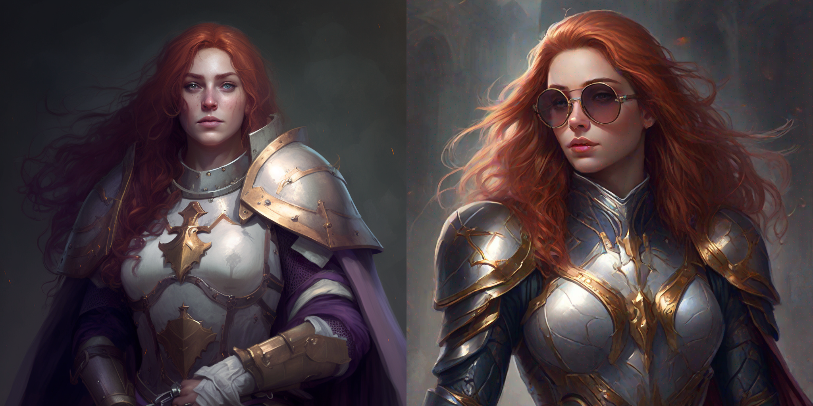

# Trajectory Consistency Distillation

[]()
[](https://mhh0318.github.io/tcd)
[](https://huggingface.co/h1t/TCD-SDXL-LoRA)
[](https://huggingface.co/spaces/h1t/TCD-SDXL-LoRA)

Official Repository of the paper: [Trajectory Consistency Distillation]()


## 📣 News
- (🔥New) 2024/2/29 We provided a demo of TCD on 🤗 Hugging Face Space. Try it out [here](https://huggingface.co/spaces/h1t/TCD-SDXL-LoRA).
- (🔥New) 2024/2/29 We released our model [TCD-SDXL-Lora](https://huggingface.co/h1t/TCD-SDXL-LoRA) in 🤗 Hugging Face.
- (🔥New) 2024/2/29 TCD is now integrated into the 🧨 Diffusers library. Please refer to the [Usage](#usage-anchor) for more information.

## Introduction

TCD, inspired by [Consistency Models](https://arxiv.org/abs/2303.01469), is a novel distillation technology that enables the distillation of knowledge from pre-trained diffusion models into a few-step sampler. In this repository, we release the inference code and our model named TCD-SDXL, which is distilled from [SDXL Base 1.0](https://huggingface.co/stabilityai/stable-diffusion-xl-base-1.0). We provide the LoRA checkpoint in this 🔥[repository](https://huggingface.co/h1t/TCD-SDXL-LoRA).

⭐ TCD has following advantages:

- `High-Quality with Few-Step`: TCD significantly surpasses the previous state-of-the-art few-step text-to-image model [LCM](https://github.com/luosiallen/latent-consistency-model/tree/main) in terms of image quality. Notably, LCM experiences a notable decline in quality at high NFEs. In contrast, _**TCD maintains superior generative quality at high NFEs, even exceeding the performance of DPM-Solver++(2S) with origin SDXL**_. 

<!-- We observed that the images generated with 8 steps by TCD-SDXL are already highly impressive, even outperforming the original SDXL 50-steps generation results. -->
- `Versatility`: Integrated with LoRA technology, TCD can be directly applied to various models (including the custom Community Models, styled LoRA, ControlNet, IP-Adapter) that share the same backbone, as demonstrated in the [Usage](#usage-anchor).

- `Avoiding Mode Collapse`: TCD achieves few-step generation without the need for adversarial training, thus circumventing mode collapse caused by the GAN objective. 
In contrast to the concurrent work [SDXL-Lightning](https://huggingface.co/ByteDance/SDXL-Lightning), which relies on Adversarial Diffusion Distillation, TCD can synthesize results that are more realistic and slightly more diverse, without the presence of "Janus" artifacts.


For more information, please refer to our paper [Trajectory Consistency Distillation]().

<a id="usage-anchor"></a>

## Usage
To run the model yourself, you can leverage the 🧨 Diffusers library.
```bash
pip install diffusers transformers accelerate peft
```
And then we clone the repo.
```bash
git clone https://github.com/jabir-zheng/TCD.git
cd TCD
```
Here, we demonstrate the applicability of our TCD LoRA to various models, including [SDXL](https://huggingface.co/stabilityai/stable-diffusion-xl-base-1.0), [SDXL Inpainting](https://huggingface.co/diffusers/stable-diffusion-xl-1.0-inpainting-0.1), a community model named [Animagine XL](https://huggingface.co/cagliostrolab/animagine-xl-3.0), a styled LoRA [Papercut](https://huggingface.co/TheLastBen/Papercut_SDXL), pretrained [Depth Controlnet](https://huggingface.co/diffusers/controlnet-depth-sdxl-1.0), [Canny Controlnet](https://huggingface.co/diffusers/controlnet-canny-sdxl-1.0) and [IP-Adapter](https://github.com/tencent-ailab/IP-Adapter) to accelerate image generation with high quality in few steps.

### Text-to-Image generation
```py
import torch
from diffusers import StableDiffusionXLPipeline
from scheduling_tcd import TCDScheduler 

device = "cuda"
base_model_id = "stabilityai/stable-diffusion-xl-base-1.0"
tcd_lora_id = "h1t/TCD-SDXL-LoRA"

pipe = StableDiffusionXLPipeline.from_pretrained(base_model_id, torch_dtype=torch.float16, variant="fp16").to(device)
pipe.scheduler = TCDScheduler.from_config(pipe.scheduler.config)

pipe.load_lora_weights(tcd_lora_id)
pipe.fuse_lora()

prompt = "Beautiful woman, bubblegum pink, lemon yellow, minty blue, futuristic, high-detail, epic composition, watercolor."

image = pipe(
    prompt=prompt,
    num_inference_steps=4,
    guidance_scale=0,
    # Eta (referred to as `gamma` in the paper) is used to control the stochasticity in every step.
    # A value of 0.3 often yields good results.
    # We recommend using a higher eta when increasing the number of inference steps.
    eta=0.3, 
    generator=torch.Generator(device=device).manual_seed(0),
).images[0]
```


### Inpainting
```py
import torch
from diffusers import AutoPipelineForInpainting
from diffusers.utils import load_image, make_image_grid
from scheduling_tcd import TCDScheduler 

device = "cuda"
base_model_id = "diffusers/stable-diffusion-xl-1.0-inpainting-0.1"
tcd_lora_id = "h1t/TCD-SDXL-LoRA"

pipe = AutoPipelineForInpainting.from_pretrained(base_model_id, torch_dtype=torch.float16, variant="fp16").to(device)
pipe.scheduler = TCDScheduler.from_config(pipe.scheduler.config)

pipe.load_lora_weights(tcd_lora_id)
pipe.fuse_lora()

img_url = "https://raw.githubusercontent.com/CompVis/latent-diffusion/main/data/inpainting_examples/overture-creations-5sI6fQgYIuo.png"
mask_url = "https://raw.githubusercontent.com/CompVis/latent-diffusion/main/data/inpainting_examples/overture-creations-5sI6fQgYIuo_mask.png"

init_image = load_image(img_url).resize((1024, 1024))
mask_image = load_image(mask_url).resize((1024, 1024))

prompt = "a tiger sitting on a park bench"

image = pipe(
  prompt=prompt,
  image=init_image,
  mask_image=mask_image,
  num_inference_steps=8,
  guidance_scale=0,
  eta=0.3, # Eta (referred to as `gamma` in the paper) is used to control the stochasticity in every step. A value of 0.3 often yields good results.
  strength=0.99,  # make sure to use `strength` below 1.0
  generator=torch.Generator(device=device).manual_seed(0),
).images[0]

grid_image = make_image_grid([init_image, mask_image, image], rows=1, cols=3)
```


### Versatile for Community Models
```py
import torch
from diffusers import StableDiffusionXLPipeline
from scheduling_tcd import TCDScheduler 

device = "cuda"
base_model_id = "cagliostrolab/animagine-xl-3.0"
tcd_lora_id = "h1t/TCD-SDXL-LoRA"

pipe = StableDiffusionXLPipeline.from_pretrained(base_model_id, torch_dtype=torch.float16, variant="fp16").to(device)
pipe.scheduler = TCDScheduler.from_config(pipe.scheduler.config)

pipe.load_lora_weights(tcd_lora_id)
pipe.fuse_lora()

prompt = "A man, clad in a meticulously tailored military uniform, stands with unwavering resolve. The uniform boasts intricate details, and his eyes gleam with determination. Strands of vibrant, windswept hair peek out from beneath the brim of his cap."

image = pipe(
    prompt=prompt,
    num_inference_steps=8,
    guidance_scale=0,
    # Eta (referred to as `gamma` in the paper) is used to control the stochasticity in every step.
    # A value of 0.3 often yields good results.
    # We recommend using a higher eta when increasing the number of inference steps.
    eta=0.3, 
    generator=torch.Generator(device=device).manual_seed(0),
).images[0]
```


### Combine with styled LoRA
```py
import torch
from diffusers import StableDiffusionXLPipeline
from scheduling_tcd import TCDScheduler 

device = "cuda"
base_model_id = "stabilityai/stable-diffusion-xl-base-1.0"
tcd_lora_id = "h1t/TCD-SDXL-LoRA"
styled_lora_id = "TheLastBen/Papercut_SDXL"

pipe = StableDiffusionXLPipeline.from_pretrained(base_model_id, torch_dtype=torch.float16, variant="fp16").to(device)
pipe.scheduler = TCDScheduler.from_config(pipe.scheduler.config)

pipe.load_lora_weights(tcd_lora_id, adapter_name="tcd")
pipe.load_lora_weights(styled_lora_id, adapter_name="style")
pipe.set_adapters(["tcd", "style"], adapter_weights=[1.0, 1.0])

prompt = "papercut of a winter mountain, snow"

image = pipe(
    prompt=prompt,
    num_inference_steps=4,
    guidance_scale=0,
    # Eta (referred to as `gamma` in the paper) is used to control the stochasticity in every step.
    # A value of 0.3 often yields good results.
    # We recommend using a higher eta when increasing the number of inference steps.
    eta=0.3, 
    generator=torch.Generator(device=device).manual_seed(0),
).images[0]
```


### Compatibility with ControlNet
#### Depth ControlNet
```py
import torch
import numpy as np
from PIL import Image
from transformers import DPTFeatureExtractor, DPTForDepthEstimation
from diffusers import ControlNetModel, StableDiffusionXLControlNetPipeline
from diffusers.utils import load_image, make_image_grid
from scheduling_tcd import TCDScheduler 

device = "cuda"
depth_estimator = DPTForDepthEstimation.from_pretrained("Intel/dpt-hybrid-midas").to(device)
feature_extractor = DPTFeatureExtractor.from_pretrained("Intel/dpt-hybrid-midas")

def get_depth_map(image):
    image = feature_extractor(images=image, return_tensors="pt").pixel_values.to(device)
    with torch.no_grad(), torch.autocast(device):
        depth_map = depth_estimator(image).predicted_depth

    depth_map = torch.nn.functional.interpolate(
        depth_map.unsqueeze(1),
        size=(1024, 1024),
        mode="bicubic",
        align_corners=False,
    )
    depth_min = torch.amin(depth_map, dim=[1, 2, 3], keepdim=True)
    depth_max = torch.amax(depth_map, dim=[1, 2, 3], keepdim=True)
    depth_map = (depth_map - depth_min) / (depth_max - depth_min)
    image = torch.cat([depth_map] * 3, dim=1)

    image = image.permute(0, 2, 3, 1).cpu().numpy()[0]
    image = Image.fromarray((image * 255.0).clip(0, 255).astype(np.uint8))
    return image

base_model_id = "stabilityai/stable-diffusion-xl-base-1.0"
controlnet_id = "diffusers/controlnet-depth-sdxl-1.0"
tcd_lora_id = "h1t/TCD-SDXL-LoRA"

controlnet = ControlNetModel.from_pretrained(
    controlnet_id,
    torch_dtype=torch.float16,
    variant="fp16",
).to(device)
pipe = StableDiffusionXLControlNetPipeline.from_pretrained(
    base_model_id,
    controlnet=controlnet,
    torch_dtype=torch.float16,
    variant="fp16",
).to(device)
pipe.enable_model_cpu_offload()

pipe.scheduler = TCDScheduler.from_config(pipe.scheduler.config)

pipe.load_lora_weights(tcd_lora_id)
pipe.fuse_lora()

prompt = "stormtrooper lecture, photorealistic"

image = load_image("https://huggingface.co/lllyasviel/sd-controlnet-depth/resolve/main/images/stormtrooper.png")
depth_image = get_depth_map(image)

controlnet_conditioning_scale = 0.5  # recommended for good generalization

image = pipe(
    prompt, 
    image=depth_image, 
    num_inference_steps=4, 
    guidance_scale=0,
    eta=0.3, # A parameter (referred to as `gamma` in the paper) is used to control the stochasticity in every step. A value of 0.3 often yields good results.
    controlnet_conditioning_scale=controlnet_conditioning_scale,
    generator=torch.Generator(device=device).manual_seed(0),
).images[0]

grid_image = make_image_grid([depth_image, image], rows=1, cols=2)
```


#### Canny ControlNet
```py
import torch
from diffusers import ControlNetModel, StableDiffusionXLControlNetPipeline
from diffusers.utils import load_image, make_image_grid
from scheduling_tcd import TCDScheduler 

device = "cuda"
base_model_id = "stabilityai/stable-diffusion-xl-base-1.0"
controlnet_id = "diffusers/controlnet-canny-sdxl-1.0"
tcd_lora_id = "h1t/TCD-SDXL-LoRA"

controlnet = ControlNetModel.from_pretrained(
    controlnet_id,
    torch_dtype=torch.float16,
    variant="fp16",
).to(device)
pipe = StableDiffusionXLControlNetPipeline.from_pretrained(
    base_model_id,
    controlnet=controlnet,
    torch_dtype=torch.float16,
    variant="fp16",
).to(device)
pipe.enable_model_cpu_offload()

pipe.scheduler = TCDScheduler.from_config(pipe.scheduler.config)

pipe.load_lora_weights(tcd_lora_id)
pipe.fuse_lora()

prompt = "ultrarealistic shot of a furry blue bird"

canny_image = load_image("https://huggingface.co/datasets/hf-internal-testing/diffusers-images/resolve/main/sd_controlnet/bird_canny.png")

controlnet_conditioning_scale = 0.5  # recommended for good generalization

image = pipe(
    prompt, 
    image=canny_image, 
    num_inference_steps=4, 
    guidance_scale=0,
    eta=0.3, # A parameter (referred to as `gamma` in the paper) is used to control the stochasticity in every step. A value of 0.3 often yields good results.
    controlnet_conditioning_scale=controlnet_conditioning_scale,
    generator=torch.Generator(device=device).manual_seed(0),
).images[0]

grid_image = make_image_grid([canny_image, image], rows=1, cols=2)
```



### Compatibility with IP-Adapter
⚠️ Please refer to the official [repository](https://github.com/tencent-ailab/IP-Adapter/tree/main) for instructions on installing dependencies for IP-Adapter.
```py
import torch
from diffusers import StableDiffusionXLPipeline
from diffusers.utils import load_image, make_image_grid

from ip_adapter import IPAdapterXL
from scheduling_tcd import TCDScheduler 

device = "cuda"
base_model_path = "stabilityai/stable-diffusion-xl-base-1.0"
image_encoder_path = "sdxl_models/image_encoder"
ip_ckpt = "sdxl_models/ip-adapter_sdxl.bin"
tcd_lora_id = "h1t/TCD-SDXL-LoRA"

pipe = StableDiffusionXLPipeline.from_pretrained(
    base_model_path, 
    torch_dtype=torch.float16, 
    variant="fp16"
)
pipe.scheduler = TCDScheduler.from_config(pipe.scheduler.config)

pipe.load_lora_weights(tcd_lora_id)
pipe.fuse_lora()

ip_model = IPAdapterXL(pipe, image_encoder_path, ip_ckpt, device)

ref_image = load_image("https://raw.githubusercontent.com/tencent-ailab/IP-Adapter/main/assets/images/woman.png").resize((512, 512))

prompt = "best quality, high quality, wearing sunglasses"

image = ip_model.generate(
    pil_image=ref_image, 
    prompt=prompt,
    scale=0.5,
    num_samples=1, 
    num_inference_steps=4, 
    guidance_scale=0,
    eta=0.3, # A parameter (referred to as `gamma` in the paper) is used to control the stochasticity in every step. A value of 0.3 often yields good results.
    seed=0,
)[0]

grid_image = make_image_grid([ref_image, image], rows=1, cols=2)
```


### Local Gradio Demo
Install the `gradio` library first,
```bash
pip install gradio==3.50.2
```
then local gradio demo can be launched by:
```py
python gradio_app.py
```


## Citation
```bibtex
@article{zheng2024trajectory,
  title = {Trajectory Consistency Distillation},
  author = {Zheng, Jianbin and Hu, Minghui and Fan, Zhongyi and Wang, Chaoyue and Ding, Changxing and Tao, Dacheng and Cham, Tat-Jen},
  journal = {arXiv},
  year = {2024},
}
```

## Acknowledgments
This codebase heavily relies on the 🤗[Diffusers](https://github.com/huggingface/diffusers) library and [LCM](https://github.com/luosiallen/latent-consistency-model).
